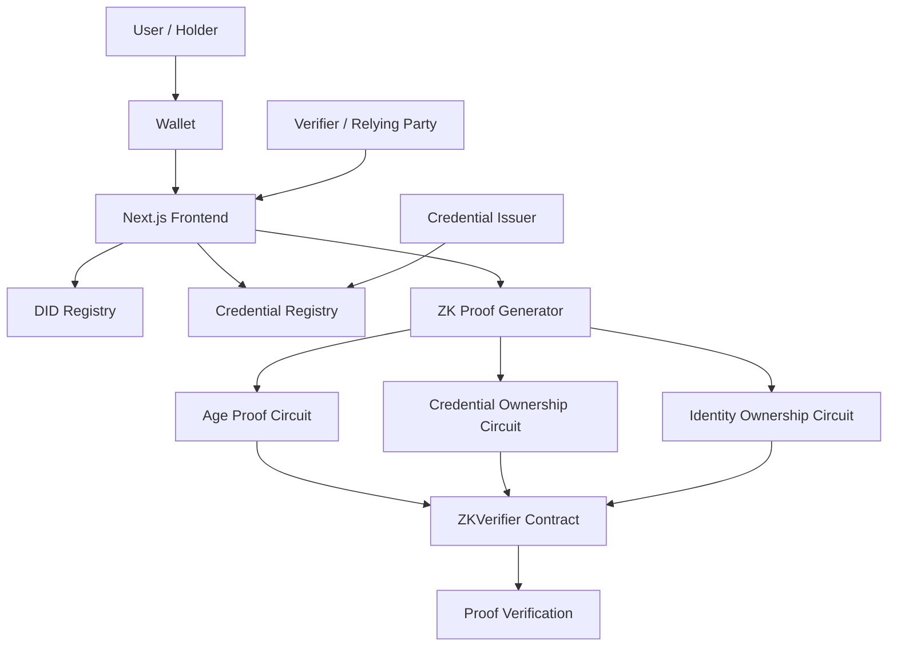

# TrustID — Sovereign Identity Platform

> **Prove who you are. Share nothing more.**

TrustID is a blockchain-based sovereign identity platform that combines **Decentralized Identifiers (DIDs)**, **Verifiable Credentials**, and **Zero-Knowledge (ZK) proofs** to enable privacy-preserving identity verification.

Instead of repeatedly exposing sensitive personal information, TrustID is designed around a simple principle: **prove the claim you need to prove, without unnecessarily revealing the data behind it.**

---
## Overview


Traditional identity verification often requires users to disclose more information than a verifier actually needs.

For example:

- An age-restricted service may only need to know that a user is **18 or older**.
- An organization may only need to know that a user **holds a valid credential**.
- A relying party may need to establish that someone **controls a particular decentralized identity**.

TrustID provides the infrastructure for these use cases through three core layers:

```text
1. Decentralized Identity — an on-chain DID registry tied to a user's wallet address.
2. Verifiable Credentials — credentials represented by hashes and managed through a blockchain registry.
3. Zero-Knowledge Proofs — Noir circuits for proving claims without exposing the underlying private inputs.

```
---


## Problem

Digital identity systems commonly force users to choose between convenience and privacy.

Users may be required to:

- Share complete identity documents when only one attribute is needed.
- Trust centralized identity providers with sensitive information.
- Repeatedly submit the same credentials to different services.
- Reveal personal data when a simple yes/no verification would be sufficient.
- Depend on centralized databases for identity ownership.

This creates unnecessary data exposure and introduces additional trust dependencies between users, issuers, and verifiers.
---

## Solution

TrustID introduces a **self-sovereign identity workflow** where the user controls their identity wallet and can present cryptographic proofs for specific claims.

The platform separates identity ownership, credential management, and claim verification:

```text
                    ┌──────────────────────┐
                    │        HOLDER        │
                    │      User Wallet     │
                    └──────────┬───────────┘
                               │
                ┌──────────────┼──────────────┐
                │              │              │
                ▼              ▼              ▼
          ┌──────────┐  ┌────────────┐  ┌──────────────┐
          │   DID    │  │ Credentials│  │  ZK Proofs   │
          │ Registry │  │  Registry  │  │    Noir      │
          └──────────┘  └────────────┘  └───────┬──────┘
                │              │               │
                └──────────────┴───────┬───────┘
                                       ▼
                              ┌─────────────────┐
                              │    VERIFIER     │
                              │ Verify the claim│
                              └─────────────────┘

```

## Tech Stack

### Frontend


### Web3


### Smart Contracts


### Zero-Knowledge


## Core Features

### 1. Decentralized Identity

- Create, update, and revoke on-chain DIDs.
- Associate DID URIs and public-key hashes with wallets.
- Track DID ownership, timestamps, and active status.

### 2. Verifiable Credentials

- Issue and verify credentials through an on-chain registry.
- Support Age Proof, Citizenship, University Degree, and Credential Ownership.
- Store credential hashes instead of sensitive credential data.
- Support credential retrieval, expiration checks, and revocation.

### 3. Zero-Knowledge Proofs

TrustID includes three Noir circuits for privacy-preserving verification:

- **Age Proof** — Prove you meet an age requirement without revealing your date of birth.
- **Credential Ownership Proof** — Prove ownership of a specific credential without revealing its contents.
- **Identity Ownership Proof** — Prove control of a DID-related secret without exposing the private key.

All proof circuits use **nullifiers** to provide replay protection.
## Architecture

---

## Three-Party Identity Model

TrustID follows a three-party identity model:

| Role | Description | Responsibility |
|---|---|---|
| **Holder** | End user | Owns the identity, manages credentials and generates proofs |
| **Issuer** | Government, university, employer, or other authority | Issues credentials to a holder |
| **Verifier** | Application, organization, or service | Verifies a presented proof or claim |

The model allows the holder to present a cryptographic proof instead of directly handing over the underlying personal information.




## Design

## Design Principles

TrustID is built around several principles:

### Privacy by Default

Only the information required for a verification should be exposed.

### User Ownership

The holder should control their identity and credentials rather than depending on a single centralized identity provider.

### Cryptographic Verification

Trust should come from verifiable cryptographic proofs rather than simply trusting a claim.

### Minimal Disclosure

A verifier should be able to validate a claim without receiving the complete underlying personal record.

### Verifiable Infrastructure

Identity, credential status, and proof verification are designed to be independently verifiable through blockchain state and cryptographic proofs.

---

## Project Summary

TrustID brings together:

```text
Decentralized Identity
        +
Verifiable Credentials
        +
Zero-Knowledge Proofs
        +
Blockchain Verification
        =
Privacy-Preserving Identity